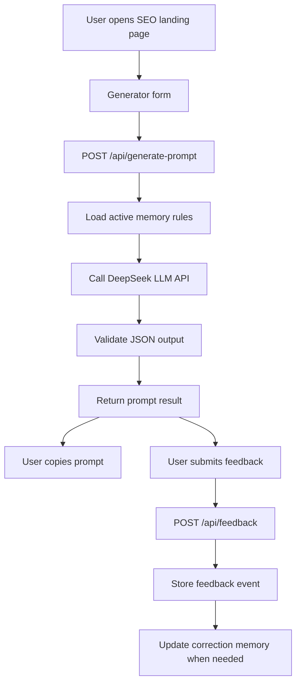

# DND Character Prompt Generator Development Document

Date: 2026-06-01
Status: Draft for implementation
Backend requirement: Simple Python backend with DeepSeek LLM API integration

## 1. Recommended Architecture

Use a lightweight two-part architecture:

- Frontend: landing application and generator UI.
- Backend: Python API service that calls DeepSeek and stores feedback memory.

Recommended stack for 1-2 day MVP:

- Frontend:
  - Static HTML/CSS/JS, or Next.js/Astro if SEO pre-rendering is desired.
  - Prefer static or server-rendered public pages for SEO.
- Backend:
  - Python FastAPI.
  - SQLite for feedback memory.
  - Environment variable for DeepSeek API key.
- Deployment:
  - Frontend: static host or same server.
  - Backend: small VPS, Render, Railway, Fly.io, or similar.

## 2. High-Level System Flow



## 3. Backend API

### POST `/api/generate-prompt`

Purpose:

- Generate DND prompt output from structured user inputs.

Request:

```json
{
  "output_type": "character_portrait",
  "race": "Tiefling",
  "class_role": "Warlock",
  "style": "dark fantasy illustration",
  "mood": "mysterious",
  "description": "A clever pact-bound traveler with a silver staff",
  "alignment": "Chaotic Good",
  "weapon": "silver staff",
  "background": "ancient ruined library",
  "target_model": "midjourney"
}
```

Response:

```json
{
  "request_id": "uuid",
  "template_version": "v1",
  "memory_rule_version": "v1",
  "main_prompt": "...",
  "short_prompt": "...",
  "negative_prompt": "...",
  "style_notes": "...",
  "usage_tip": "..."
}
```

Validation:

- Required fields cannot be empty.
- Description length should be capped.
- Output type must be from allowed values.
- Target model must be from allowed values.

Failure behavior:

- If DeepSeek fails, return a friendly error.
- Do not expose API keys or raw provider errors.
- Optionally return a deterministic fallback template.

### POST `/api/feedback`

Purpose:

- Store user feedback and update lightweight correction memory.

Request:

```json
{
  "request_id": "uuid",
  "feedback": "not_useful",
  "reason": "too_generic",
  "comment": "The prompt did not mention Tiefling horns or infernal details."
}
```

Response:

```json
{
  "saved": true,
  "message": "Thanks. Future prompts will use this feedback."
}
```

### GET `/api/health`

Purpose:

- Basic service health check.

Response:

```json
{
  "ok": true
}
```

## 4. Data Model

### Table: `prompt_requests`

Fields:

- `id`
- `created_at`
- `output_type`
- `race`
- `class_role`
- `style`
- `mood`
- `description`
- `target_model`
- `template_version`
- `memory_rule_version`
- `main_prompt`
- `short_prompt`
- `negative_prompt`

### Table: `feedback_events`

Fields:

- `id`
- `created_at`
- `request_id`
- `feedback`
- `reason`
- `comment`
- `input_snapshot`
- `output_snapshot`

### Table: `memory_rules`

Fields:

- `id`
- `created_at`
- `updated_at`
- `status`
- `rule_key`
- `rule_text`
- `trigger_reason`
- `times_seen`
- `version`

## 5. Self-Iteration Logic

### MVP approach

Start simple:

- Store every feedback event.
- Use predefined correction rules for common negative reasons.
- Increase `times_seen` when a reason repeats.
- Include active rules in generation prompts.

### Negative feedback mapping

| Feedback reason | Correction behavior |
| --- | --- |
| Too generic | Add more race/class/gear/background-specific visual detail |
| Not DND-specific enough | Add tabletop fantasy terms and DND-style composition |
| Wrong style | Prioritize selected style and avoid conflicting style words |
| Missing details | Use all non-empty user fields explicitly |
| Too long | Generate tighter prompt under target length |
| Too short | Add composition, lighting, texture, and mood details |
| Token not usable | Force top-down, centered, readable silhouette |

### Prompt assembly

DeepSeek system instruction should include:

- Product role.
- Safety rules.
- Output schema.
- DND prompt quality rules.
- Active correction memory rules.

Example memory injection:

```text
Active correction memory:
- Users often dislike generic Tiefling prompts. When race is Tiefling, include horns, tail, skin tone, eyes, infernal ornamentation, and silhouette.
- For token prompts, always specify top-down view, centered full-body figure, readable outline, simple background, and VTT usability.
```

## 6. DeepSeek Integration

Configuration:

- `DEEPSEEK_API_KEY`
- `DEEPSEEK_BASE_URL`
- `DEEPSEEK_MODEL`
- `LLM_TIMEOUT_SECONDS`

Security:

- API key stays server-side.
- Never expose provider errors directly to users.
- Rate-limit generation endpoint.
- Cap input size.

Recommended generation settings:

- Temperature: medium.
- JSON response requested.
- Timeout: 20-40 seconds.
- Retry once on transient failures.

## 7. Frontend Pages

### `/`

Purpose:

- Main landing page and generator.

Sections:

- Hero + generator.
- Example outputs.
- How it works.
- Prompt types.
- FAQ.
- Internal links to long-tail pages.

### `/dnd-character-prompt-generator`

Purpose:

- Character portrait intent page.

### `/dnd-token-prompt-generator`

Purpose:

- VTT token intent page.

### `/dnd-monster-prompt-generator`

Purpose:

- Monster/NPC intent page.

### `/dnd-scene-prompt-generator`

Purpose:

- Tavern, dungeon, forest, battle scene prompt intent.

### Required utility pages

- `/about`
- `/privacy`
- `/terms`
- `/contact`

## 8. UI Requirements

- Mobile-first.
- Generator visible in first viewport.
- Clear form labels.
- No login required.
- Copy buttons.
- Loading state.
- Error state.
- Empty state with examples.
- Feedback buttons after output.
- Footer links to About, Privacy, Terms, Contact.

## 9. Non-Functional Requirements

- Fast first load.
- Public pages should be crawlable.
- No important SEO content hidden behind client-only rendering.
- Backend should fail gracefully.
- Feedback logging should not block the user.
- Avoid collecting unnecessary personal data.

## 10. Development Phases

### Day 1

- Build landing page.
- Build generator form.
- Build Python `/api/generate-prompt`.
- Connect DeepSeek.
- Generate JSON output.
- Add copy buttons.
- Add About, Privacy, Terms, Contact.

### Day 2

- Add feedback capture.
- Add SQLite memory.
- Add correction rule injection.
- Add SEO metadata.
- Add FAQ and JSON-LD.
- Add sitemap and robots.
- Add first 10-20 long-tail pages or page templates.

## 11. Launch Checklist

- DeepSeek API key configured.
- API does not leak secrets.
- Prompt generation works.
- Feedback saves.
- Negative feedback affects later prompts.
- All footer pages exist.
- Homepage title, description, canonical, OG, Twitter metadata exist.
- FAQ visible and JSON-LD matches visible FAQ.
- Sitemap includes real public routes.
- Robots allows intended public pages.
- Contact method works.

